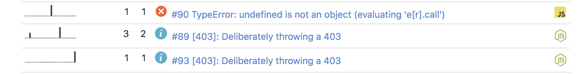

## class HttpError {...}

Wrapper around Rollbar.js, which:

* Comes with its own Express Middleware,
* Allows you to create custom errors with 4xx or 5xx HTTP error codes,
* Files HTTP errors in Rollbar as _info_. Regular old unplanned errors are filed as _error_.
* Fixes the Express request body so Rollbar sees the correct Host, URL, and IP address if behind a proxy.

Usage with Express:

    const express = require('express');
    const HttpError = require('rollbar-http-error');
    const config = require('./config');

    const app = express();
    app.set('trust proxy', true);

    // .. app init code ..

    // Final middleware
    app.use(HttpError.middleware(config.rollbarToken));

If `rollbarToken` is null or undefined, then errors will be printed to the console.

## View from Rollbar.js

The target use-case is one where HttpErrors are necessary, and planned, and thrown out to the Express middleware to be delivered to the user. It's important to track them in Rollbar but they're not critical issues and they should not trigger alerts.

Here's the view of a real error vs an HttpError:

## Using in the app

Inside your app, throw errors:

    const HttpError = require('rollbar-http-error');

    // ...

    if (!logged_in) {
      throw HttpError.forbidden('You must be logged in.');
    }
    if (!found) {
      throw HttpError.notFound('That page does not exist.');
    }
    if (!validate(req)) {
      throw HttpError.badRequest('Bad request.');
    }

Throw custom errors:

    if (isDeprecated()) {
      throw new HttpError(410, 'That page is GONE.');
    }

Send custom HTTP headers:

    if (!valid_jwt()) {
      const headers = {
        'WWW-Authenticate': 'Bearer',
      }
      throw new HttpError(401, 'JWT timed out', headers);
    }

Send custom JSON body:

    if (error_details.length) {
      const body = {
        error_details,
      };
      throw new HttpError(403, 'Encountered several errors', {}, body);
    }

Send a good old fashioned 500 error and report the error to rollbar:

    if (!db) {
      throw new Error('Application error: No db is defined');
    }

## Reporting to Rollbar

It is possible to access Rollbar directly, either as `debug`, `warning`, `info`, or `error`. This will print to the console if no Rollbar token was passed to the middleware:

    HttpError.report.warning('This should not happen', req);
    
It is possible to access the raw rollbar instance. This will return `undefined` if no Rollbar token was passed to the middleware:

    const rollbar = HttpError.rollbar();
